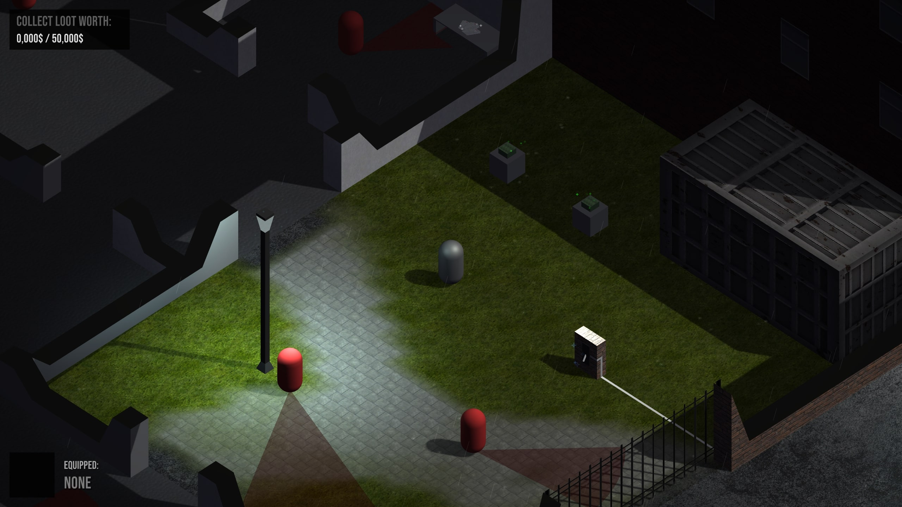

# Mission Impossible: MHAZM

Team Members (Names & Roles)

- Muhammad Mahad BSCS 2021 FAST NU LHR
- Hamad Yousaf BSCS 2021 FAST NU LHR
- Syed Zaki Haider BSCS 2021 FAST NU LHR
- Muhammad Ali Abid BSCS 2021 FAST NU LHR
- Abdul Moiz BSCS 2021 FAST NU LHR

# Game Overview

## Introduction

"Mission Impossible: MHAZM" is a 3D Isometric stealth-action game with puzzle-solving elements. It has a total of six levels with increasing difficulty levels. In each level, we have an open design map, in which the player can move freely. Main goal of the player is to dodge the patrolling guards and collect the loot and drop them to a safe zone. The main goal is the outsmart guards, solve maze-like rooms, loot valuables, and upgrade your skills without getting caught.

Key aspects such as the main character (the thief), the core gameplay loop (Action, Rewards, Progression), and the overall story of a burglar escalating from petty theft to breaking into highly secured places were maintained. The unique selling point of delivering a lightweight game incorporating mechanics from AAA stealth titles was a guiding principle throughout development.
Minor iterative refinements were made during the development cycle, primarily in level design to enhance player experience and puzzle complexity. Power-up mechanics were fine-tuned based on internal testing to ensure balanced gameplay. The number of levels is set to six, focusing on quality and replayability, with a framework for future expansion.

### Genre

Our game falls under the stealth and action genre. It focuses on sneaky gameplay where the player avoids guards, solves puzzles, and collects loot without getting caught. While there’s some action involved.

### Target Audience

Our main target audience is core gamers, especially those between the ages of 18 to 35. These are players who enjoy thinking through challenges. The game is perfect for people who love stealth, strategy, and solving tricky puzzles in intense, sneaky situations.

### Demo

### Unique Selling Point

A lightweight stealth-action experience inspired by watch dogs, Hitman, Ghost Recon. It preserves some of the core mechanics of AAA game titles while being optimized for performance and simplicity in control and graphics.

### Implemented Features

Stealth System: Players must actively hide from patrolling guards. A line-of-sight and proximity-based detection system for guards was implemented.

### Audio System

We have added the system of audio based on surrounding, including rain, player detection and adventurous voice

### Puzzle Solving

Each level is designed as a maze-like puzzle requiring players to find keys, unlock doors, and navigate complex environments to reach an extraction point.

### Collectibles & Loot

Players can collect valuables within each level, contributing to their score and potentially usable for an in-game currency system for power-ups, as proposed.

### Score/Inventory Display

The score increases as the player collects the loot and drops it in the loot zone.

### Particle system

Rain implemented to increase the player experience

### Main Menu

Displaying of the main menu for selecting levelsloghting

### Street lamp

Street lamp base point lightening system
Dynamic Player speed: The speed of the player becomes slower when loot is being collected, this produces realistic and immersive gameplay.

### Player Progression

An XP system was implemented, allowing players to level up. Game difficulty progressively increases with each level, featuring more astute guards and complex maze layouts.

### Game Controls

Intuitive controls for player movement (left, right, forward, backward), interaction with objects (collecting items, opening doors), and activating power-ups were implemented.

### Gadgetry

Taking inspiration from classic stealth and spy genres, basic gadgets to assist in infiltration were included, such as a basic lock picking tool.

### Complete map designing

There are multiple map designs each have its own unique adventure leading to an immersive game experience.

## User Interface (UI)

The UI was designed to be minimalistic yet informative and interesting, providing the player with essential information without cluttering the screen:

### Detection Meter

Visually indicates the player's visibility to guards or proximity to detection.

- Inventory Display: Shows collected keys, loot, and available power-ups

- Objective Display: Clearly states the current mission objective for the level

# Story & Setting

## Storyline

Raised in poverty, the protagonist grew up mastering petty theft. Now, he's evolved into a skilled infiltrator, targeting high-security vaults, banks, and research labs. His goal? Stack the loot, stay in the shadows, and become a legend in the underworld.
Game World

Realistic environments with security guards
Maze like architecture of the world
Obstacles, buildings, cars and walls
Surveillance systems
Patrolling Guards
Visuals focus on clean and minimalist but immersive level designs. The maintype Capsule based 3D model (stylized humanoid)
Abilities: Movement, hiding, interaction with objects, loot

# Gameplay Mechanics

- Core Gameplay Loop
- Spawn into a level
- Scout the environment
- Avoid patrols and surveillance
- Collect money and loot
- Unlock new areas
- Actions
- Move in four directions (WASD)
- Interact collectibles
- Hide behind objects
- Navigate maze puzzles
- Zoom In/Out option for immersive experience
- Rewards
- Level Unlocks
- Loot collected
- Progression
- 6 levels of increasing difficulty
- Each level has unique layouts and patrol logic
- More complex puzzle paths

# Player Objectives

Evade detection from AI-controlled patrolling guards
Navigate through maze-like rooms and collect a key
Unlock doors and escape to the next level
Optional: Collect all loot for bonus XP and in-game currency

# Game Controls

- Action
- Input
- Move
- WASD
- Interact / Collect

# Level design

Each of the 6 levels includes:
Unique maze layout
Distinct patrol routes
Environmental variations (e.g., laser traps, cameras)

# Technical Base

6 custom levels
Updated enemy patrol logic
Custom character models and power-ups
Save & checkpoint system

# References & Inspirations

- Hitman – Stealth & disguise system
- Watch Dogs – Environment hacking vibe
- Among Us – Simple movement & hidden role mechanics
- Metal Gear Solid – Tactical espionage action
